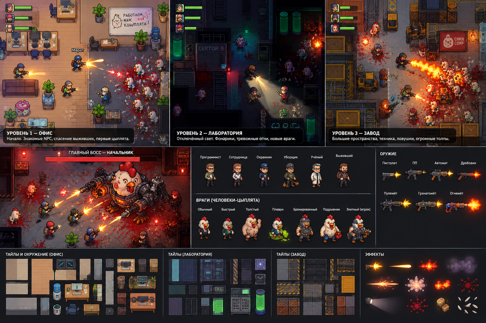

# CHKN OUTBREAK: переход к 2.5D и простой кооперативной мясорубке

Дата: 2026-10-02. Статус: первая итерация реализована; полная переделка в работе. Фактические отметки — в [TASKS-2.5D.md](TASKS-2.5D.md), доказательства — в [отчёте проверки](qa/office-iteration.md).

- [Задачи и распределение работы между агентами](TASKS-2.5D.md)
- [Реестр источников ассетов](ASSETS.md)
- [Референс пользователя](references/chkn-2.5d-reference.png)

## 1. Цель и результаты проверки

Сохранить Phaser 3, TypeScript, Colyseus и общую симуляцию. Сделать **детальный пиксель-арт в три четверти**, как по композиции референса: видимые лица, ноги, передние грани мебели, объёмные стены и выразительный свет.

Зафиксированные решения:

- Только бесплатные ассеты; готовые библиотеки — основа, собственная графика — для недостающих элементов.
- Кампания: офис → лаборатория → завод → босс, с короткими переходами и боевыми аренами.
- Игроки всегда союзники. Неожиданно превращаться могут NPC, включая вооружённых спутников.
- Поднятие, лечение и передача боеприпасов — одной кнопкой, без отдельного инвентаря.
- Сохранить драйв исходной игры: скорость движения, частоту стрельбы, урон оружия, отдачу, комбо, звуки и быстрый отклик. В первой итерации параметры `weapons.ts` и `enemies.ts` не менялись; переход к волнам не должен превращать бой в медленное тактическое ожидание.

**Что проверено:** короткий бой в офисе через интерфейс; автоматический бой во всех пяти сценах; сборка; сетевые подключения, готовность, поднятие, четыре участника, отказ пятому, смена ведущего и восстановление сессии через SDK. Полное прохождение кампании и игру четырёх людей через интернет пока нельзя считать проверенными.

**Проблемы исходной версии при подготовке плана:**

- Поднятие через стену воспроизведено: персонаж получает 45 HP при заблокированной видимости.
- Сервер допускает переподключение, но игровой клиент его автоматически не выполняет.
- Превращение NPC сейчас фактически заменяет человека врагом; отдельного состояния мутации нет.
- Персонажи вращаются целиком, предметы используют фиксированные слои — это мешает выбранному ракурсу.
- На узком экране интерфейс перекрывает здоровье и бой.
- Проверка через программный WebGL показала примерно 13–24 FPS. Это не оценка обычной видеокарты, но основание отдельно проверить стоимость освещения.

Проверки выше выполнены при подготовке плана 2026-10-02. Они описывают исходную версию, а не приёмку будущей переделки. Пятиуровневый smoke-тест использовал короткие автоматические бои с повышенным HP; его результаты не подтверждают баланс или прохождение.

В первой итерации исправлена помощь через стену, добавлены автоматическое переподключение клиента, состояния мутации и помощь одной кнопкой. Офис получил направленные LPC-спрайты, фасады, сортировку по стопам и новый пол; HUD проверен на пяти размерах. Серверные проверки кооператива проходят. В двух игровых страницах проверены E-поднятие и автоматический возврат с тем же ID/расходниками. Истечение окна/отмена и граница этапов ещё требуют UI-проверки. Новые три волны на арену, остальные уровни, босс и полная художественная приёмка остаются в плане.

## 2. Ассеты: источники и способ переделки

Общая художественная база — **LPC, исходная сетка 32 px, единая палитра Liberated Palette**. Мир сохраняет текущую логическую клетку 64 единицы. Спрайты масштабируются согласованно, без размытия; исходные наборы разного разрешения проходят адаптацию.

Ниже перечислены источники для всех основных групп. Это карта приобретения с нулевым бюджетом и адаптации, а не утверждение, что каждый нужный предмет уже есть готовым.

| Ассеты игры | Источник | Что сделать |
|---|---|---|
| Полы офиса, стены, окна, двери | [LPC Revised — Base Structure Kit](https://opengameart.org/content/lpc-revised-base-structure-kit), CC BY-SA 3.0 | Собрать деревянные, плиточные и нейтральные покрытия. Разделить стены на основание, фасад и верхнюю часть. |
| Столы сотрудников, ноутбуки, принтер, кулер, мусорные корзины | [LPC Revised — The Office](https://opengameart.org/content/lpc-revised-the-office), доступны OGA-BY 3.0 / CC BY-SA 3.0 | Использовать офисные предметы; рабочие места собирать из стола, компьютера, кружки и бумаг. |
| Стулья, диваны, шкафы, столы переговорных, кухонная мебель, растения, стеллажи, ящики | [LPC Revised — Base Object Kit](https://opengameart.org/content/lpc-revised-base-object-kit), CC BY-SA 3.0 | Выбрать современные варианты, убрать средневековые детали. Ресепшен собрать из модулей столов и шкафов. |
| Лабораторные полы, панели, технические двери, консоли, оборудование | [Warped Top-Down Tech Lab 2](https://opengameart.org/content/warped-top-down-tech-lab-2), CC0 | Привести к общей палитре; сохранить холодный металл, зелёные индикаторы и красное аварийное освещение. |
| Серверные стойки, генераторы, автоматы, лифт | Лабораторный набор выше и [Skorpio’s SciFi Sprite Pack](https://opengameart.org/content/lpc-skorpios-scifi-sprite-pack), CC BY-SA 3.0 | Составные предметы из технических панелей и корпусов; собственные подписи и маркировка. |
| Конвейеры, трубы, производственные терминалы | [Factory Tileset — rubberduck](https://opengameart.org/content/factory-tileset), CC0 | Перерисовать несовпадающие по плотности пикселей детали, согласовать контуры и масштаб с LPC. |
| Паллеты, складские штабели, бочки | Base Object Kit + Factory Tileset | Собрать варианты высоты, целые и разрушенные состояния. Погрузчики в первой версии заменить складскими композициями с сохранением нужных препятствий. |
| Игроки и сотрудники: программист, сотрудница, охранник, уборщик, учёный, выживший | [LPC Character Bases](https://opengameart.org/content/lpc-character-bases) и одежда из [Universal LPC](https://github.com/LiberatedPixelCup/Universal-LPC-Spritesheet-Character-Generator) | Собрать шесть обликов из готовых тел, волос и одежды. Сохранить лицензии каждого слоя. Четыре различимых игровых персонажа; портреты получить из их же спрайтов. |
| Маленькие куры и цыплята | [LPC Chicken Rework](https://opengameart.org/node/83296), CC BY 3.0 | Использовать готовую четырёхнаправленную ходьбу; адаптировать окраску и размер. Указать Daniel Eddeland и исходную страницу. |
| Люди-петухи: обычный, быстрый, толстый, плюющийся, бронированный, подрывник | Тела и одежда LPC + адаптация Chicken Rework | Собственная доработка головы, гребня, крыльев и лап. Сохранять одежду бывшего NPC. Разновидности различать силуэтом и экипировкой, не одним цветом. |
| Пистолет, ПП, автомат, пулемёт | Оружейные элементы Skorpio’s SciFi Sprite Pack | Адаптировать четыре отчётливых силуэта, положения рук, отдачу и точки вылета. |
| Дробовик | [LPC Shotgun Animation and Icon](https://opengameart.org/content/lpc-shotgun-animation-and-icon), CC0 | Использовать как основу спрайта и оружейной позы. |
| Гранатомёт, огнемёт, оружие босса | Оружейные детали Skorpio | Собственная сборка: широкий ствол гранатомёта; баллон и сопло огнемёта. Не обозначать их как готовые комплектные ассеты. |
| Генеральный Петух | Механические элементы Skorpio + собственная куриная голова и корпус | Составной босс с отдельно анимируемыми руками, оружием, головой и повреждаемой бронёй. |
| Дым, вспышки, искры, огонь, взрывы | [Kenney Particle Pack](https://kenney.nl/assets/particle-pack), CC0 | Подготовить компактные текстуры, согласовать детализацию. Свет оставить мягким, боевые частицы — короткими и читаемыми. |
| Кровь, кислота, следы взрывов | [Kenney Splat Pack](https://kenney.nl/assets/splat-pack), CC0 | Перекрасить, подготовить небольшой набор вариантов; размещать под персонажами. |
| Перья, скорлупа, капсулы с яйцами, промежуточные стадии мутации | Производные куриных и лабораторных элементов | Собственная адаптация: целая/треснувшая/разбитая капсула, несколько перьев и стадий превращения. |
| Аптечка, пакет патронов, пропуск, корпоративные плакаты, доски, указатели | Корпуса предметов выбранных наборов + собственная пиксельная разметка и текст | Простые узнаваемые пиктограммы. Интерфейс сохранить HTML/CSS; новые большие декоративные панели не нужны. |

Для каждого импортированного кадра создать запись: игровой идентификатор, автор, URL, исходный файл и область изображения, лицензия, изменения, итоговый атлас. Сохранить исходные лицензии и добавить доступные из игры титры. Производные LPC-ассеты распространять с соответствующими условиями ShareAlike. При нескольких лицензиях фиксировать выбранную для конкретного файла.

**Генерацию изображений не включать в основной процесс.** Сначала готовый спрайт, затем сборка и адаптация. Отдельно созданная графика нужна прежде всего для петухов, мутаций и босса.

## 3. Переделка изображения и интерфейсов

- Сохранить ортогональную игровую плоскость, WASD, столкновения и навигацию. Объём получить спрайтами в три четверти, высотой объектов, тенями и перекрытиями.
- Заменить вращение тела на направленные анимации. Основа — четыре направления LPC; оружие и руки отдельно сопровождают свободный прицел. Ходьба зависит от движения, верх тела — от направления огня.
- Ввести описание графики персонажа: кадры, точка стоп, положение корпуса, крепление оружия, дуло, тень. Общие преобразования координат использовать для прицеливания, трассеров, попаданий и фонарей.
- Сортировать людей, врагов и мебель по нижней точке на полу. Высокие предметы разделять на части; переднюю стену делать полупрозрачной, когда она закрывает игрока.
- Отделить размеры спрайта от препятствия на полу. У столов, шкафов и стоек коллизия должна соответствовать основанию. Произвольные повороты мебели заменить подготовленными направлениями.
- Офис сделать тёплым и обжитым, лабораторию — холодной и тревожной, завод — контрастным, с оранжевыми источниками света. Детализацию сосредоточить по краям проходов.
- Перья, бумага и обломки усиливают попадания; короткая вспышка и отдача подчёркивают оружие. Ограничить количество частиц, динамических источников света и постоянных следов.
- HUD: компактная команда сверху слева, задача отдельно, текущее оружие и патроны снизу. Крупные сообщения не должны закрывать бой. Рядом с выбранным другом показывать имя и доступное действие.

Изменения общих типов: описание визуальных опорных точек, цель и прогресс помощи, переносимые расходники, состояние заражения NPC и состояние текущей волны. Эти данные должны одинаково работать в одиночной игре и сетевых снимках.

## 4. Геймплей, помощь и заражение

### Волны и темп

Сохранить существующие уровни и юмор, сократить цепочки поиска ключей. Основной цикл: **войти в помещение → пережить несколько волн → подобрать припасы/спасти NPC → перейти дальше**.

- Офис обучает стрельбе, мутации и спасению; лаборатория добавляет отключения света и разбитые капсулы; завод — конвейеры, взрывающиеся бочки и большие стаи.
- На арену закладывать три волны примерно по 25–40 секунд и короткую передышку между ними.
- Численность масштабировать на 1/2/3/4 игроков множителями 1 / 1,6 / 2,2 / 2,8. Обычных противников сохранять быстро убиваемыми; увеличивать прежде всего количество.
- Ввести общий ограничитель активных и ожидающих появления врагов. Первоначальный предел — 120 активных; лишние остаются в очереди.
- Точки выхода стаи заранее обозначать звуком, тряской двери или решётки. Запретить появление непосредственно под игроком.
- Показать номер волны и оставшихся врагов. Если враг застрял вне доступной области, переносить его к допустимому входу после проверки навигации.

### Одна кнопка помощи

Дистанция — 80 единиц мира, обязательна свободная линия до товарища. Цель подсвечивается и фиксируется на время действия.

- **Удержать E возле лежащего:** поднять за 2,6 секунды до 45 HP, без расходника.
- **Удержать E возле раненого:** потратить аптечку, восстановить 40 HP за 1,2 секунды.
- **Коротко нажать E возле живого:** передать пакет, добавляющий один магазин в резерв его текущего оружия. Пистолет с бесконечным запасом исключить.
- Каждый несёт одну аптечку и один универсальный пакет патронов; запас пополняется у ящиков снабжения между аренами. Никаких окон обмена.
- Без товарища удержание E лечит самого игрока, если он ранен и имеет аптечку.
- Поднятие имеет приоритет; взаимодействие с дверью или NPC срабатывает только при отсутствии выбранного товарища.
- Короткое нажатие выполняется при отпускании. Начатое удержание не должно попутно передавать патроны или многократно переключать следование NPC.
- Во время поднятия и лечения помощник не стреляет; движение, отпускание кнопки или потеря доступности отменяют действие. Расходник списывается только при успешном завершении.

После истечения времени спасения игрок наблюдает за командой и возвращается человеком в следующую передышку. Если живых игроков не осталось — быстрый перезапуск арены. Дружественный огонь отключён.

### Непредсказуемые NPC

Первая офисная мутация остаётся постановочным обучением. Дальнейшие превращения определяет сервер:

- У спасённого или присоединившегося NPC — начальная вероятность скрытого заражения 25%; проверка однократная.
- Заражённый спутник успевает помогать минимум 20 секунд. Превращение назначается через 35–90 секунд после присоединения.
- Не более одного одновременного превращения и двух случайных предательств на уровень; между ними минимум 30 секунд.
- Последние 2,2 секунды читаются явно: сбой поведения → судорога и перья → разрыв силуэта → петух. Атака начинается только после окончания превращения.
- Сохраняются одежда, узнаваемая деталь и связь с прежним именем. Реплика перед мутацией может напоминать о недавней помощи.
- NPC прекращает союзный огонь при начале явной мутации. Оружие выпадает; обычный мутант переходит к куриной атаке.
- Ключи и обязательные предметы выпадают при смерти или превращении, чтобы предательство не блокировало прохождение.
- Обычная аптечка не отменяет скрытое заражение. Отдельную систему диагностики и лечения инфекции в первую версию не добавлять.

### Сеть

Сервер подтверждает помощь, расходники, волны и мутации. Снимки содержат прогресс действий и мутаций, чтобы подключившийся игрок видел правильную стадию. Клиент автоматически восстанавливает соединение в существующем 25-секундном окне. При потере связи сбрасываются стрельба и помощь; повторные сообщения не дублируют выдачу ресурсов.

## 5. Порядок реализации и приёмка

1. **Зафиксировать документы и референс.** Этот план — `docs/PLAN-2.5D.md`, картинка — `docs/references/chkn-2.5d-reference.png`, источники — `docs/ASSETS.md`, задачи — `docs/TASKS-2.5D.md`. Обновить прежние решения о строгом виде сверху и единственном наборе Kenney. Сохранение документов не означает выполнение переделки.
2. **Собрать образцовый офисный бой.** Одна законченная комната: мебель, новый игрок, три вида петухов, оружие, свет, правильные перекрытия и превращение союзника. Сначала проверить её целостность в движении.
3. **Внедрить кооперативную помощь и сетевые исправления.** Убрать PvPvE игроков, исправить поднятие через стены, добавить расходники и переподключение.
4. **Перестроить кампанию вокруг арен.** Перенести готовые правила и графику на лабораторию, завод и босса; сохранить полигон для проверки оружия.
5. **Проверить итоговую игру.**

Критерии приёмки:

- Сборка и автоматический бой проходят во всех сценах.
- Персонаж корректно проходит перед мебелью и за ней; прицел, дуло и попадания совпадают на всех направлениях.
- Два и четыре клиента видят одинаковые мутации, смерти, волны и результаты помощи.
- Поднятие и лечение невозможны через стену; два помощника не удваивают лечение и не расходуют лишние предметы.
- Передача патронов не превышает максимальный запас, не дублируется и работает при отпускании кнопки.
- Проверены разрыв связи, возвращение, смена ведущего, подключение посреди волны и задержка 100–200 мс.
- Кампания проходима при смерти или превращении любого сюжетного NPC.
- HUD проверен на 1920×1080, 1280×720 и мобильных размерах, включая узкую панель.
- Производительность измерена отдельно на аппаратном WebGL: цель — стабильные 60 FPS на проверяемом ПК при четырёх игроках и 100 врагах; мобильная цель — 30 FPS с упрощённым светом. Результаты программного рендерера записываются отдельно.
- Финальное прохождение включает все уровни, босса и хотя бы один сценарий «спасли союзника → он помогал → превратился».

## Границы работы

Исходная версия продолжает использовать текущие зависимости. План не предусматривает смену движка, ромбическую изометрию, платные наборы, полноценную 3D-сцену, PvP игроков, отдельное меню инвентаря или покупку ассетов. Числа баланса выше — начальные согласованные значения; изменения по результатам прохождения фиксируются в отчёте и журнале решений.
