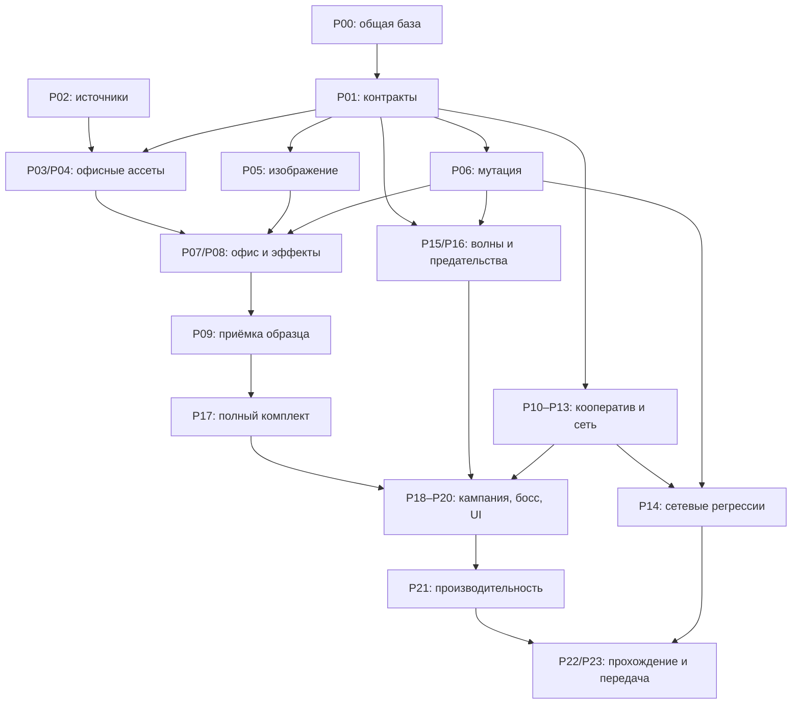

# Задачи 2.5D: работа несколькими агентами

Дата: 2026-10-02. Источник требований: [PLAN-2.5D.md](PLAN-2.5D.md).

Статусы: `[ ]` не начато, `[~]` частично реализовано / требует приёмки, `[x]` принято с доказательствами. Отметка «принято» означает выполнение критерия задачи, а не только наличие кода. Первая итерация реализована одним Codex в общей рабочей копии; доказательства и ограничения — в [qa/office-iteration.md](qa/office-iteration.md). Художественный образец P09 пока не принят для переноса на всю кампанию.

## Как раздавать работу

Для каждого пакета назначить одного владельца. Агент получает ID задач, зону файлов, зависимости и критерии ниже. Количество агентов можно менять, объединяя последовательные пакеты, но два агента не должны одновременно редактировать один файл.

| Пакет | Ответственность | Основная зона |
|---|---|---|
| I — координатор | Общие контракты, интеграция, сборки, приёмка, актуальный статус | Общие типы и протокол, документация, точки интеграции |
| A — ассеты | Бесплатные источники, адаптация, персонажи, атласы и лицензии | `vendor/`, `tools/art/`, `tools/build-assets.mjs`, `docs/ASSETS.md` |
| B — изображение | Персонажи в три четверти, порядок перекрытий, стены, FX, свет | `src/client/render/`, `src/client/scenes/`, графические метаданные |
| C — симуляция и сеть | Помощь, смерть игроков, заражение, волны, переподключение | `src/shared/sim/`, `server/`, `src/client/net/`, игровые параметры |
| D — уровни и интерфейс | Карты, сюжет, HUD, кнопка помощи, мобильный ввод | `tools/levels/`, `src/shared/levels/`, `src/client/ui/`, `src/client/input/`, `src/client/styles.css` |
| Q — QA | Независимые сценарии, сетевые проверки, визуальные отчёты, производительность | `tools/` для QA, будущие тесты и `docs/qa/` |

Координатор хранит фактические владельцы и результаты в журнале внизу этого файла. Работать в отдельных ветках/worktrees с общей исходной базой. Незакоммиченные и неотслеживаемые файлы обычный worktree не копирует: перед раздачей координатор должен убедиться, что исходники доступны каждому агенту. Не включать личные настройки и секреты в общий коммит базы.

### Общие точки, где требуется один владелец

- `src/shared/sim/types.ts`, `src/shared/protocol.ts`, `src/shared/map.ts`, `src/shared/props.ts`: контрактом владеет I; изменения реализации передаются ему согласованным патчем. C не меняет формат без согласования.
- `src/client/scenes/GameScene.ts`: владелец B. D передаёт ему подключение HUD/ввода, C — требования к состояниям и событиям.
- `src/client/ui/App.ts`: владелец D. C передаёт ему патч жизненного цикла соединения; координатор интегрирует его до последующего изменения лобби.
- `tools/build-maps.ts`: владелец I при изменении формата, D — после принятия контракта карты.
- `src/shared/generated/artMeta.json` и производные файлы `public/assets/`: генерировать из исходников, не редактировать вручную. В общей рабочей копии окончательные `assets` и `maps` запускает I последовательно.
- `package.json`, lockfile, `TASKS.md`, `docs/DECISIONS.md`, `docs/HANDOFF.md`: обновляет I. Остальные агенты описывают необходимые изменения в передаче результата.

Если требуется выйти за свою зону, сначала согласовать передачу файла с координатором. Не отменять изменения соседнего агента ради прохождения своей сборки.

## Этап 0 — контракты и исходная база

- [x] **P00 / I: зафиксировать базу и владельцев.** Проверить доступность исходников во всех рабочих копиях; назначить владельцев пакетов; воспроизвести исходную сборку и доступные проверки. **Готово:** все агенты работают от одной базы, известны ограничения исходной версии.
- [~] **P01 / I: согласовать общие интерфейсы.** Описать и внедрить минимальные типы визуальных опорных точек, основания предмета, помощи, расходников, стадии заражения, источника внешности мутанта и состояния волны; добавить передачу через снимки и события. Различение нажатия/удержания E должно выполняться один раз на действие. **Готово:** сборка проходит, LocalSession и NetSession читают новые поля, опубликован пример данных для A/B/C/D.
- [~] **P02 / A: проверить фактический состав источников.** Скачать только бесплатные наборы из ASSETS, прочитать лицензии файлов и составить список: готово / адаптация / недостаёт. Назначить конкретный исходный файл и область для каждого элемента офисного образца. **Готово:** реестр не выдаёт предполагаемые ассеты за импортированные; сохранены авторы и выбранные лицензии.

P02 можно выполнять одновременно с P00/P01. P01 — обязательная точка синхронизации перед изменением общего формата данных.

## Этап 1 — образцовый офисный бой

- [~] **P03 / A: офисное окружение и сборка атласов.** Подготовить пол, стены, двери, стол, компьютер, стул, шкаф, растение, кулер и ящик; описать основание, направления и порядок частей. **Зависит:** P01, P02. **Готово:** воспроизводимая сборка, совпадающие масштаб/палитра, нет размытых пикселей и несуществующих кадров.
- [~] **P04 / A: персонажи, оружие и мутация для образца.** Четыре различимых игрока, офисный NPC, обычный/быстрый/толстый петух, пистолет и автомат, стадии превращения. Сохранить одежду NPC после мутации. **Зависит:** P01, P02. **Готово:** направления, ходьба, огонь, ранение и опорные точки работают на проверочной сцене; каждый кадр имеет источник или отметку собственной адаптации.
- [~] **P05 / B: ракурс и перекрытия.** Реализовать направленные тела, отдельные руки/оружие, стопы, тени, сортировку по полу, фасады мебели, полупрозрачную закрывающую стену. Общую логику мировых координат сохранить. **Зависит:** P01; сначала допустимы временные кадры, окончательная проверка после P03/P04. **Готово:** обход стола и проход за высокой мебелью выглядят правильно, прицел/дуло/трассер/попадание согласованы на всех направлениях.
- [x] **P06 / C: стадии превращения NPC.** Реализовать подготовку, явную мутацию 2,2 с и переход в врага; прекращение союзного огня; сохранение связи с NPC/внешности; однократный выпад оружия и обязательных предметов. **Зависит:** P01. **Готово:** до завершения мутации враг не атакует; два клиента и позднее подключение видят одну стадию; переход не дублируется.
- [~] **P07 / D: офисная комната и компактный HUD.** Собрать одну арену из P03, игрока и NPC из P04; разместить входы волн, припасы и цель; исправить перекрытие здоровья/задачи. **Зависит:** P01, P03, P04, P05; визуальная мутация после P06. **Готово:** комнату можно пройти, одежда спутника узнаётся после превращения, HUD читается в 1280×720 и узкой панели.
- [~] **P08 / B: эффекты и освещение образца.** Добавить короткие вспышки, отдачу, бумагу, перья, дым и следы под персонажами; тёплый офисный свет. Ограничить частицы и свет; сохранять исправление пересоздания RenderTexture. **Зависит:** P03–P05. **Готово:** бой читается в движении, FX не закрывают цели, есть замер до/после.
- [~] **P09 / I + Q: принять офисный образец.** Пройти комнату в одиночку и вдвоём, проверить перекрытия, стрельбу, мутацию, интерфейс и сборку. **Зависит:** P06–P08. **Готово:** скриншоты и отчёт в `docs/qa/`; устранены видимые ошибки. Только после P09 переносить художественный подход на всю кампанию.

P03/P04 выполняются последовательно одним A или раздаются разным агентам с разделёнными исходниками. B/C/D могут работать параллельно после P01, соблюдая владение файлами.

## Этап 2 — кооперативная помощь и сеть

- [x] **P10 / C: помощь и расходники в симуляции.** Дистанция 80, свободная линия, фиксированная цель; поднятие 2,6 с до 45 HP; лечение 1,2 с на 40 HP; пакет патронов даёт один магазин в резерв текущего оружия. Ёмкость — по одной аптечке/пакету. Проверять ограничения запаса. **Зависит:** P01. **Готово:** отмена действием/движением/преградой не списывает расходник; два помощника не удваивают эффект; через стену помочь нельзя.
- [~] **P11 / D: одно действие E на ПК и телефоне.** Нажатие при отпускании передаёт пакет, удержание лечит/поднимает; показать имя, действие и прогресс. Поднятие приоритетно; кнопка не повторяет переключение следования NPC. **Зависит:** P01, P10. **Готово:** одинаковое поведение клавиатуры/сенсорной кнопки; начатое удержание не выполняет передачу патронов; самопомощь работает без товарища.
- [~] **P12 / C: игроки остаются командой.** Заменить превращение игрока на наблюдение до следующей передышки; вернуть человека; поражение при отсутствии живых; быстрый перезапуск арены; дружественный огонь отключён. Проверить перенос оружия и расходников. **Зависит:** P01, P10, интерфейс передышек из P15. **Готово:** игрок не становится врагом; возврат и поражение одинаковы в solo/co-op; отсутствуют старые обещания PvPvE в лобби/HUD после интеграции с D.
- [~] **P13 / C с интеграцией D: восстановление соединения.** Автоматический reconnect в существующем окне 25 с; восстановление уровня/состояния; сброс удерживаемого огня и помощи при разрыве. Передать патч App.ts владельцу D. **Зависит:** P01. **Готово:** сессия восстанавливается, расходники и события не дублируются; выход ведущего передаёт роль; окончательный отказ отображается понятно.
- [~] **P14 / Q: сетевые регрессии.** Два/четыре клиента, пятый отклоняется, готовность, помощь через стену, одновременные помощники, двойные сообщения, разрыв/возврат, подключение посреди мутации, задержка 100–200 мс. **Зависит:** P06, P10–P13. **Готово:** воспроизводимые сценарии и результаты; сервер и клиенты согласованы. Если есть только протокольный тест, не объявлять UI проверенным.

P10/P13 могут начинаться параллельно с образцом. P11 получает стабильный контракт P10. Изменения C в World.ts для помощи, мутаций и волн объединяет один владелец последовательно.

## Этап 3 — волны, предательства и кампания

- [ ] **P15 / C: общий контроллер волн.** Три волны на арену, ориентир 25–40 с; передышки; множители 1/1,6/2,2/2,8; максимум 120 активных врагов, остальные в очереди. Синхронизировать фазу, номер и остаток. Контролировать безопасные входы и недоступных врагов. **Зависит:** P01. **Готово:** очереди и переходы завершаются, число живых участников учитывается согласованно, застрявший враг не блокирует арену.
- [x] **P16 / C: случайные предательства.** Шанс 25% один раз на NPC; задержка 35–90 с; не менее 20 с помощи; максимум два случайных предательства на уровень, одно одновременно, интервал 30 с. Использовать авторитетный RNG и таймеры; сохранять назначение заражения при переносе спутника. **Зависит:** P06. **Готово:** проверено с фиксированным seed; NPC нельзя повторно «перебросить» переподключением/переназначением; обязательные предметы сохраняют прохождение.
- [ ] **P17 / A: полный комплект окружения и врагов.** Лаборатория/завод, все шесть людей-петухов и цыплёнок, шесть обликов сотрудников, семь видов оружия, капсулы/обломки/расходники. Погрузчики заменяются складскими композициями. **Зависит:** P09. **Готово:** все используемые уровнем ID имеют подготовленные кадры и метаданные; лицензии и источники заполнены; нет смешения старой гладкой графики с новой пиксельной.
- [ ] **P18 / D: кампания на аренах.** Переделать офис, лабораторию и завод; сократить поиск ключей; сохранить спасения/реплики; включить сигналы входа волн и ящики снабжения. Повторно использовать принятый образец. **Зависит:** P09, P15–P17. **Готово:** каждый уровень проходим в solo и co-op, смерть/мутация сюжетного NPC не блокирует обязательный маршрут.
- [ ] **P19 / A + B + C + D, последовательно: босс.** A подготавливает составной спрайт; B подключает анимацию и повреждённую броню; C подключает боевое состояние; D размещает арену/триггеры. В каждом общем файле действует один владелец. **Зависит:** P09, P15, P17. **Готово:** босс узнаваем, телеграфы читаются, бой и победа работают у всех участников.
- [ ] **P20 / D с подключением B: полигон и мобильный интерфейс.** Сохранить проверку всех видов оружия, прогресс помощи, компактный список команды, подсказки контекста и наблюдение. **Зависит:** P11, P12, P17. **Готово:** ПК/мобильный ввод работают; HUD проверен в 1920×1080, 1280×720, 390×844, 844×390 и узкой панели 640×720. Проверка реального телефона отдельно от эмуляции.

## Этап 4 — интеграция и финальная приёмка

- [ ] **P21 / B + Q: производительность.** Измерить аппаратный WebGL, 4 игрока/100 врагов; цель 60 FPS на проверяемом ПК и 30 FPS на проверяемом телефоне с упрощённым светом. Ограничить свет/частицы/следы, проверить смену уровня и resize на утечки. **Зависит:** P18–P20. **Готово:** записаны устройство, браузер, renderer, разрешение, настройки и длительность; программный WebGL не выдан за аппаратный.
- [ ] **P22 / I + Q: финальная интеграция и прохождение.** Последовательно собрать assets/maps, выполнить build/smoke, сетевые регрессии, полное solo/co-op прохождение с боссом и предательством ранее помогавшего NPC. **Зависит:** P14, P18–P21. **Готово:** выполнены критерии PLAN, нет ошибок/отсутствующих кадров, есть результаты и ограничения; текущие README/STYLE/HANDOFF/DECISIONS отражают реализацию.
- [ ] **P23 / I: доставка результатов.** Проверить исходные лицензии и игровые титры, прикрепить визуальные доказательства, оставить точные инструкции запуска и нерешённые проблемы. **Зависит:** P22. **Готово:** следующий агент может собрать игру из исходников и повторить проверки без устных уточнений.

## Граф зависимостей

## Что агент должен передать по завершении пакета

Краткий отчёт: выполненные ID; изменённые файлы; изменения интерфейсов; команды и результаты проверок; ссылка на скриншоты для видимых изменений; ограничения; точный следующий зависимый пакет. Изменение художественного подхода, чисел баланса или требований пользователя фиксировать явно.

Статусы общей доски и журнал решений обновляет координатор после интеграции. Чтобы агенты не конфликтовали на документах, отчёты складывать в отдельные `docs/qa/Pxx-<package>.md`.

| Задачи | Назначенный агент/ветка | Статус | Проверки и результат |
|---|---|---|---|
| P00 | Codex / `codex/office-25d-coop`, исходная база `d5e7ea8` | Принято | Исходная и новая сборки проходят; план/референс/исходники/ассеты сохранены в общей ветке, один владелец пакетов этой итерации |
| P01 | Codex / I | Частично | Передаются помощь, расходники, версия помощи, connected, мутация и внешность; финальные основания/контракт волн и пример данных ещё нужны |
| P02–P04 | Codex / A | Частично | Скачаны S01/S02/S03/S07/S08, 648 кадров персонажей и 14 окружения, исходники/credits сохранены; двери, все силуэты/оружие и конечные основания не готовы |
| P05 | Codex / B | Частично | Четыре направления, оружие отдельно, стопы, глубина, стены; нужно принять обход мебели, все снаряды/фонари и совпадение основания со спрайтом |
| P06 | Codex / C | Принято | 2,2 с, стадии, одежда/имя, остановка союзного огня, однократные выпадения; серверные сценарии и позднее сетевое подключение проходят |
| P07–P09 | Codex / B/D/Q | Частично | Существующий офис получил новый арт и HUD, проверены бой/подсказка/пять размеров, есть скриншоты; новую арену и прохождение комнаты вдвоём ещё принять |
| P10 | Codex / C | Принято | Поднятие/лечение/патроны, стены/движение/отмена/два помощника; авторитетные регрессии проходят |
| P11 | Codex / D | Частично | Общий выбор цели, тап/удержание, имя/прогресс и самопомощь; E-поднятие проверено через два UI-клиента, реальный телефон ещё нет |
| P12 | Codex / C | Частично | Игроки не превращаются; наблюдение, возврат при окончании боя, сохранение оружия/расходников, поражение и friendly fire проверены; привязка к новым передышкам P15 ещё нужна |
| P13 | Codex / C/D | Частично | Автовозврат до 24 с внутри серверного окна 25 с; SDK и два UI-клиента сохраняют ID/расходники, ввод сбрасывается; истечение окна/отмена/граница этапа требуют отдельной проверки |
| P14 | Codex / Q | Частично | Четыре SDK-клиента/отказ пятому/поздняя мутация; два UI-клиента/готовность/поднятие/E/reconnect; задержка 100–200 мс и остальные UI-регрессии ещё не проверены |
| P15 | Следующий C | Не начато | Существующие волны сохранены; общего контроллера трёх волн, очереди 120 и новых передышек пока нет |
| P16 | Codex / C | Принято | Серверный seed, один бросок 25%, 35–90 с, минимум 20 с помощи, максимум два/уровень, 30 с между ними, перенос решения; сценарии проходят |
| P17–P23 | Следующие A/B/C/D/Q/I | Не начато | Полный арт, арены кампании, босс, телефон, аппаратная производительность и финальное прохождение впереди |
| Итерация 2 | Claude / `codex/office-25d-coop` (рабочая копия) | Частично → см. D20–D27 | P04/P05/P08/P17 продвинуты: все уровни 2.5D, рантайм-персонажи М/Ж + редактор, люди-куры всех типов, босс-петух, трупы LPC, оружие в руке, мебель всех карт, музыка, подсказки, check:levels; фризы GPU устранены (p99 16,8 мс на Intel UHD). Не проверены: телефон, 4 человека по сети, ручное полное прохождение |

**Следующий порядок:** закончить P01–P05 и принять P09; C может отдельно начать P15, Q — закончить P13/P14 через браузеры. P17 не переносить на все уровни до принятия P09. Для следующих worktrees использовать `codex/office-25d-coop`: коммит `d5e7ea8` сам по себе эту итерацию не содержит. Перед раздачей проверить более новые незакоммиченные изменения.
