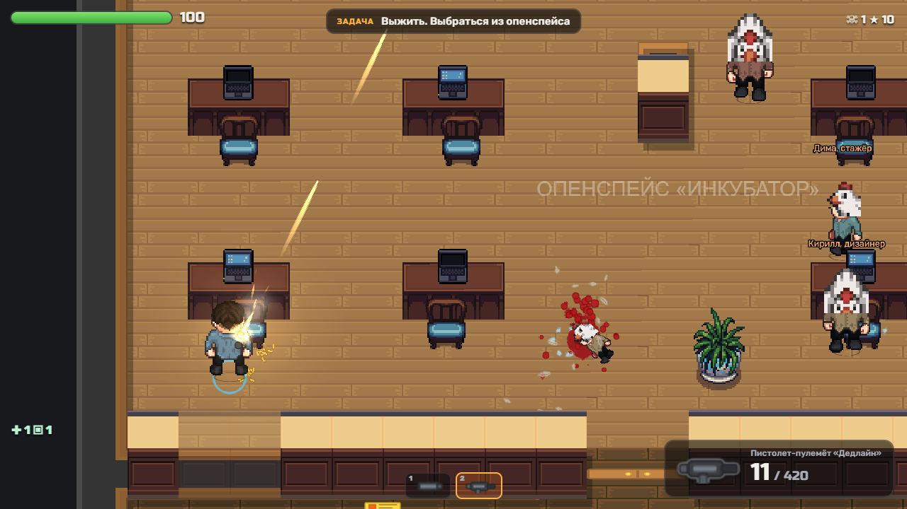
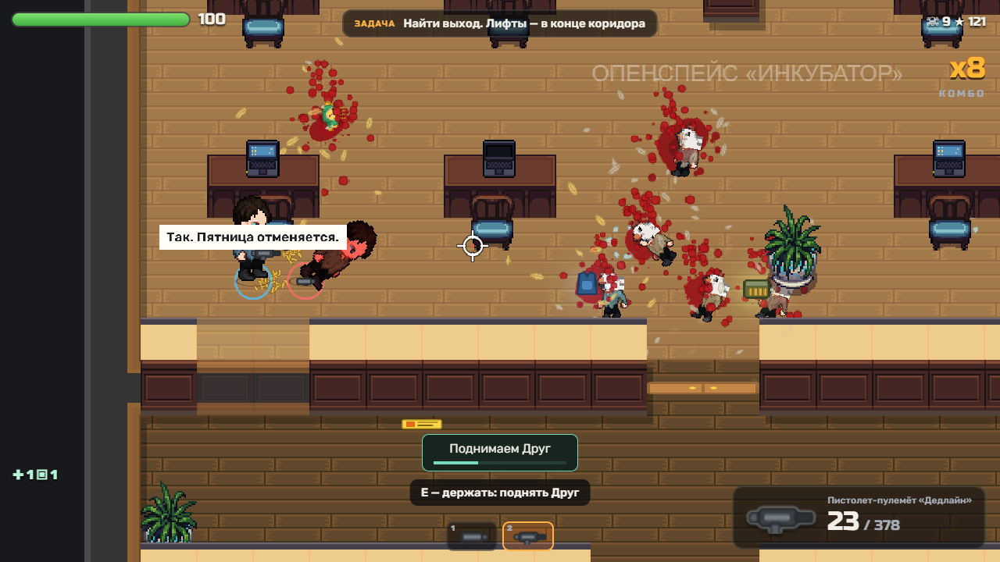

# Первая итерация 2.5D: реализация и проверки

Дата: 2026-10-02. База исходной игры: `d5e7ea8`. Итерация сохранена в локальной ветке `codex/office-25d-coop`. Статусы приёмки: [TASKS-2.5D](../TASKS-2.5D.md). Референс сохранён без изменения: [изображение](../references/chkn-2.5d-reference.png), SHA256 `1A3EA883E5A3BE5558BC953949EEFB6A7FBFA688EF12A9A3AD2732AF40B48124`.

## Что реализовано

- Офис: публичные LPC-источники, четыре направления тел, оружие отдельно, стопы/тени, глубина по полу, мебель с фасадами и стены, затухающие перед игроком. Обычные/быстрые/толстые враги и бывшие NPC имеют направленные составные кадры. В подборке 648 кадров людей/мутантов и 14 окружения. Библиотечные исходники, лицензии, авторы, версии и адаптации — в [ASSETS](../ASSETS.md) и `vendor/`; доступные из меню титры — `public/credits.html`. AI-изображения не использовались.
- E: тап — пакет патронов (магазин в конечный резерв оружия); удержание — лечение +40 HP за 1,2 с / поднятие до 45 HP за 2,6 с. По одной аптечке и пакету. Самолечение без друга, фиксированная цель, приоритет лежащего, расстояние 80 и свободная линия. Отмена не списывает; два помощника не ускоряют и не повторяют эффект. UI показывает имя и прогресс.
- Игроки остаются людьми: bleedout → наблюдение → возврат при окончании текущего боя с сохранённым оружием. При отсутствии живых подключённых — поражение. Формальная фаза передышки ещё относится к P15.
- NPC: судорога → перья → силуэт → петух за 2,2 с; до окончания союзник не стреляет и новый враг не атакует. Одежда/имя сохранены, оружие/ключи выпадают один раз. Спасённые и вооружённые друзья имеют один шанс предательства; таймеры и решение сохраняются при переходе.
- Переподключение: клиент повторяет возврат до 24 с, сервер ждёт 25 с; ввод при разрыве сбрасывается, поздний успешный handshake закрывается после выхода/таймаута. При смене уровня восстанавливается персонаж текущего мира, отключённый участник не считается подключённым в новом мире.
- Сохранение драйва: `weapons.ts`, `enemies.ts`, скорость движения, комбо, отдача и звук не менялись. Картинка/помощь не добавляют ожидания к стрельбе; управление и предсказание собственных выстрелов сохранены. Это сохранение параметров, а не доказательство финального баланса новой кампании.

## Воспроизводимые проверки

Запустить `npm run dev` и `npm run server` (сервер с debug). Если preview на другом порту: `$env:SMOKE_URL='http://localhost:5281'`. Для SDK допускается `TEST_SERVER` (по умолчанию `ws://localhost:2580`).

| Команда | Результат |
|---|---|
| `npm run assets` | Воспроизводимая сборка; области обрезки проверяются на выход за исходный PNG |
| `npm run check:art` | Хэши выбранных слоёв, архивов и курицы; 648 кадров в 2048×2048, 14 в 2048×256, направления N/W/S/E и шаги 0–8 |
| `npm run build` | TypeScript и production build проходят |
| `npm run check:coop` | 18 авторитетных сценариев проходят: длительности, стены, расходники/отмена, быстрый тап между тиками, два помощника/двойное лечение, friendly fire, disconnect, самопомощь, смерть/возврат, мутация/выпадения, один RNG-бросок/перенос/лимиты, обязательные офисные ключи |
| `npm run check:network` | Настоящие Colyseus-клиенты: готовность, совпадающее поднятие до 45 HP, reconnect с тем же ID/расходниками, позднее подключение во время мутации/внешность, четыре участника/отказ пятому, передача ведущего |
| `npm run check:network-ui` | Две игровые страницы: меню создания/входа/готовности → бой; настоящее удержание E поднимает второго игрока до 45 HP, показан прогресс; закрытие WebSocket вызывает автоматический App-reconnect, возвращаются тот же ID/расходники и новые снимки; page errors отсутствуют |
| `npm run check:office` | Контролируемый WebGL бой: последний запуск 30 выстрелов, 1 убийство, игрок жив; подсказка/прогресс поднятия появляется и исчезает при отпускании; 5 размеров без наложения здоровья/задачи и горизонтального overflow; page/console errors отсутствуют |
| `npm run smoke` | Короткие автоматические бои в arena/office/lab/factory/boss, ошибок браузера нет |

Офисный сценарий выдаёт SMG и резерв для проверки; smoke повышает HP и выдаёт оружие. Это тесты рендеринга/боевых событий, не прохождение и не проверка естественной экономики. Точные данные офисного запуска: [office-sample.json](office-sample.json).

## Визуальные доказательства

Проверенные размеры: [1280×720](office-1280x720.png), [640×720](office-640x720.png), [390×844](office-390x844.png), [844×390](office-844x390.png), [1920×1080](office-1920x1080.png).

Кооператив через две игровые страницы: [поднятие клавишей E](coop-ui-support.png), [игра после автоматического возврата](coop-ui-rejoined.png), [результаты](coop-ui.json). Для подготовки ранения использован серверный debug, сближение выполнялось автоматическим вводом; само E — клавиатурное событие. Это проверка реального UI и протокола, но не прохождение комнаты двумя людьми.

## Ограничения и следующий этап

- Измерения выполнены в Chromium с программным WebGL SwiftShader на Windows: офисный sample ~33 FPS; последний пятиуровневый smoke: arena 30, office 29, lab 18, factory 19, boss 12 FPS. Прогон — 12 с боя после загрузки каждой сцены. Это не аппаратный WebGL, не цель 60 FPS и не результат телефона. Старые 13–24 FPS имеют другой сценарий/длительность; корректного сравнения до/после ещё нет.
- P09 не принят: художественное качество ещё далеко от референса, стены/двери и размеры оснований требуют работы, часть оружия/FX/предметов старые. Персонажи пока используют одну телесную семью с разной одеждой/цветом; все профессии и силуэты типов врагов ещё нужны.
- Лаборатория, завод, босс и полигон используют старый художественный комплект. P15 не реализован: существующие волны и сюжетные ключевые цепочки сохранены. Сокращение маршрутов/три волны/очередь 120 — следующий отдельный пакет.
- Полное solo/co-op прохождение, четыре человека через интернет, сетевые 100–200 мс, UI таймаут/граница этапа, реальный телефон и аппаратные замеры не подтверждены. Не отмечать P14/P20–P23 принятыми по этим результатам.
- В общей копии один владелец выполнял I/A/B/C/D/Q последовательно. Следующим агентам нужна ветка `codex/office-25d-coop`; один `d5e7ea8` эту итерацию не содержит. Внешняя публикация не выполнялась.
